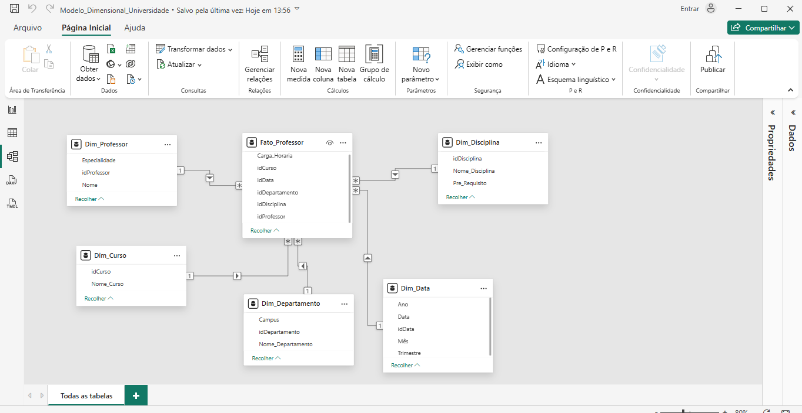

# 📊 Desafio de Projeto: Modelagem Dimensional - Star Schema (Universidade)

Este repositório contém o projeto de **Modelagem Dimensional** baseado em um cenário universitário. O objetivo principal foi transformar um diagrama relacional complexo em um **Star Schema** (Esquema em Estrela) focado na análise de dados de professores, utilizando o **Microsoft Power BI**.

---

## 🏛️ Contexto e Parcerias

* **Plataforma de Ensino**: [DIO (Digital Innovation One)](https://www.dio.me/)
* **Empresa Patrocinadora**: [Klabin](https://www.klabin.com.br/)
* **Formação**: Power BI Analyst
* **Desenvolvedor**: [Fred Cavalheiro]

---

## 🛠️ Tecnologias Utilizadas

* **[Microsoft Power BI Desktop](https://powerbi.microsoft.com/)**: Utilizado para a criação das tabelas, definição de tipos de dados e estruturação do modelo dimensional.
* **Ferramenta de Captura do Windows**: Para geração das evidências visuais do diagrama.
* **Modelagem Dimensional**: Aplicação de conceitos de Fatos, Dimensões e Cardinalidade.

---

## ⚠️ Justificativa Técnica e Adaptações de Ambiente

Como parte do meu processo de transição de carreira, este projeto foi desenvolvido com foco em **arquitetura lógica de dados**, superando limitações de infraestrutura:

* **Hardware e Resiliência**: O desenvolvimento foi realizado em máquina emprestada com hardware limitado. Por isso, as tabelas foram criadas utilizando a função **"Inserir Dados"** diretamente no Power BI, simulando a estrutura necessária sem a necessidade de servidores locais pesados.
* **Foco no Negócio**: Seguindo as diretrizes do desafio, o modelo foi simplificado para focar exclusivamente no objeto **Professor**, eliminando tabelas de Alunos e Matrículas para garantir a performance e clareza do Star Schema.
* **Restrição de Publicação**: A entrega é composta pelo arquivo fonte (`.pbix`) e pela documentação visual do diagrama de relacionamentos.

---

## 📂 Entregáveis do Projeto

Para visualizar a estrutura da modelagem, você pode acessar os arquivos abaixo:

* [📥 **Baixar Arquivo Power BI (.pbix)**](Modelo_Dimensional_Universidade.pbix)
  * *Nota: Contém a estrutura de tabelas e relacionamentos configurados.*
* [🖼️ **Ver Diagrama do Star Schema**](diagrama_star_schema_universidade.png)

---

## 🚀 Estrutura da Modelagem (Star Schema)

O projeto foi organizado seguindo a arquitetura de BI, onde as dimensões filtram a tabela fato central:

### 1. Tabela Fato (`Fato_Professor`)
* Contém as chaves estrangeiras (`IDs`) e a métrica de `Carga_Horaria`, servindo como o centro da análise de atividades dos docentes.

### 2. Tabelas Dimensão
* **`Dim_Professor`**: Dados detalhados dos docentes.
* **`Dim_Disciplina`**: Informações sobre matérias e pré-requisitos.
* **`Dim_Curso`**: Detalhes dos cursos ofertados.
* **`Dim_Departamento`**: Estrutura organizacional e localização (Campus).
* **`Dim_Data`**: Tabela calendário criada para permitir análises temporais de ofertas de disciplinas.

---

## ⚙️ Visualização do Modelo Dimensional

Abaixo, a evidência técnica da estrela configurada com relacionamentos **1:N (Um para Muitos)** e direção de filtro **Único**:

---

## 📞 Contato e Conexão
**Fred Cavalheiro**
* 🔄 **Transição de Carreira:** De Segurança Patrimonial (Vigilante) para Tecnologia/Dados.
* 🎓 **Técnico em Desenvolvimento de Sistemas** (Senac).
* 📚 **Estudante de:** Machine Learning e Análise de Dados (Python, Neo4j, Power BI e Excel).
* 🔗 **[Meu Perfil no LinkedIn](https://www.linkedin.com/in/fred-cavalheiro/)**

---
**Projeto desenvolvido para demonstrar competência em Arquitetura de Dados e Modelagem Star Schema sob restrições de hardware.**
